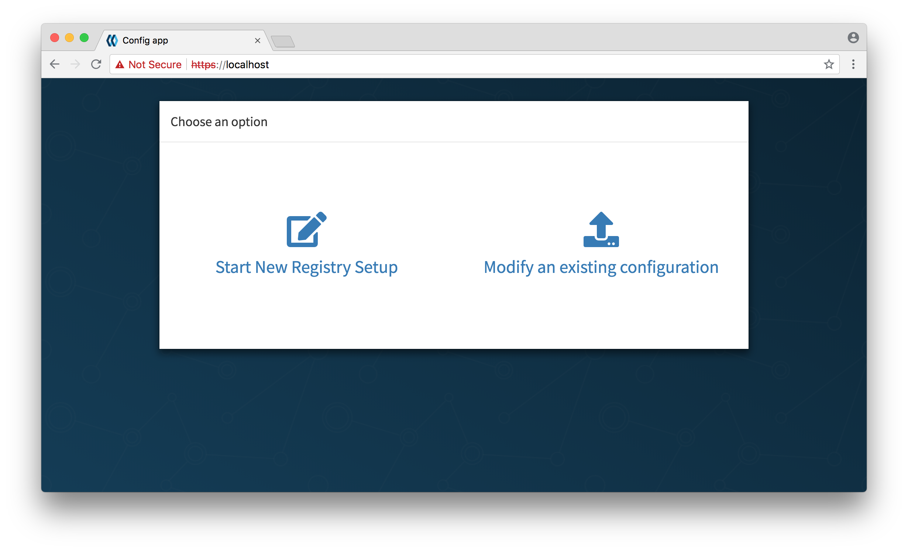
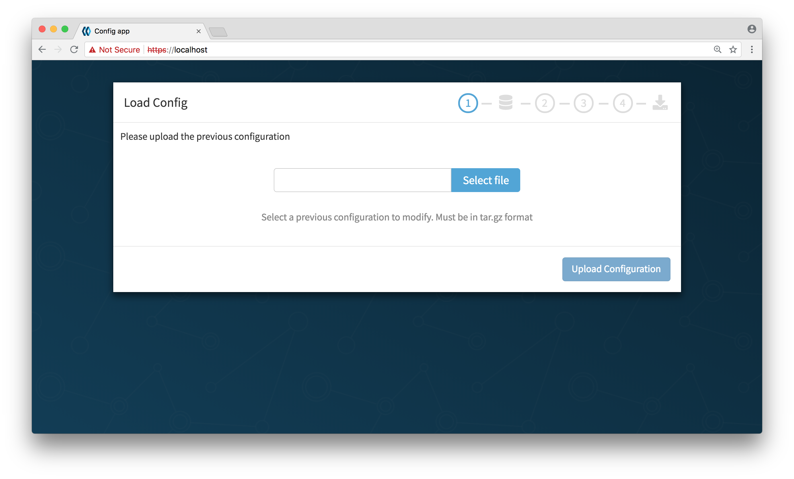

# On-premises installation

Red Hat Quay requires three components to be running to begin the setup process:

- A supported database (MySQL, Postgres)
- A Redis instance (for real-time events)
- The Red Hat Quay image

**NOTE**: Please have the host and port of the database and the Redis instance ready.

## Preparing the database

A MySQL RDBMS or Postgres installation with an empty database is required, and a login with full access to said database. This login *must* be for a superuser. The schema will be created during the creation of the configuration. The database install can either be pre-existing or run via a [Docker container](mysql-container.md).

**Note**: Running your database on as a Docker container is not recommended for production workloads.

## Setting up redis

Redis stores data which must be accessed quickly but doesn’t require durability guarantees. If you have an existing Redis instance, make sure to accept incoming connections on port 6379 (or change the port in the setup process) and then feel free to skip this step.

To run redis, simply pull and run the Quay.io Redis image:

```
sudo docker pull quay.io/quay/redis
sudo docker run -d -p 6379:6379 quay.io/quay/redis
```

**NOTE**: This host will have to accept incoming connections on port 6379 from the hosts on which the registry will run.

## Downloading the Red Hat Quay image

After signing up you will be able to download a pull secret file named `config.json`.

The `config.json` file will look like this:

```
{
  "auths": {
    "quay.io": {
      "auth": "abcdefghijklmnopqrstuvwxyz...",
      "email": ""
    }
  }
}
```

`config.json` contains your credentials for the `quay.io/coreos/quay` repository. Save this file to your machine in `/home/$USER/.docker/config.json` and `/root/.docker/config.json`. You should now be able to execute `docker pull quay.io/coreos/quay:v2.9.2` to download the container.

## Booting up the configuration tool

Now you can run the configuration setup tool to create your config bundle.

Run the following command to boot up the configuration tool:

```
sudo docker run -p 443:443 -d quay.io/coreos/quay:v3.0.0 config
```

## Creating a new configuration

Visit the image locally by going to https://yourhost/


**Note**: You will see warning about an invalid certificate authority when visiting in your browser. This is because we self sign the certificate at container load time, so you can safely bypass this warning. (On Chrome, for example, click on Advanced, then "Proceed to localhost")



Click on "Start New Registry Setup", and follow the instructions to create your configuration, downloading and saving it when complete.

**Note**: Please keep this tarball safe, as it contains your certificates and other access credentials unencryped. You will also need it if you ever wish to update your configuration.


## Setting up the directories

Red Hat Quay requires a configuration directory (and a storage directory if using local storage):

You will need to extract the tarball you received in the previous step into a directory:
```
mkdir config && tar xzf quay-config.tar.gz -C config
```


If you are storing images locally, then you will need a storage directory (skip this step if you are storing images remotely):
```
mkdir storage
```

**Note**: storing images locally is not recommended for production workloads!


## Running the registry

If you are running with local storage, you'll have to add it as a volume to the docker command, replacing `/local/path/to/the/config/directory` and `/local/path/to/the/storage/directory` with the absolute paths to the directories created in the previous step:


```
sudo docker run --restart=always -p 443:443 -p 80:80 --privileged=true -v /local/path/to/the/config/directory:/conf/stack -v /local/path/to/the/storage/directory:/datastorage -d quay.io/coreos/quay:3.0.0
```

Otherwise, run the following command, replacing `/local/path/to/the/config/directory` with the absolute path to the directory created in the previous step:

```
sudo docker run --restart=always -p 443:443 -p 80:80 --privileged=true -v /local/path/to/the/config/directory:/conf/stack -d quay.io/coreos/quay:3.0.0
```


## Verifying the status of QE

Visit the `/health/endtoend` endpoint on the Red Hat Quay hostname and verify that the `code` is `200` and `is_testing` is `false`.

If `code` is anything other than `200`, visit http://yourhost/ and you will see instructions detailing the problems Red Hat Quay is having with the configuration.


## Logging in

### If using database authentication:

Once Red Hat Quay is running, new users can be created by clicking the `Sign Up` button. If e-mail is enabled, the sign up process will require an e-mail confirmation step, after which repositories, organizations and teams can be setup by the user.


### If using LDAP authentication:

Users should be able to login to the Red Hat Quay directly with their LDAP username and password.


## Updating your configuration

If you ever wish to change your configuration, you will need to run the configuration tool again:

```
sudo docker run -p 443:443 -d quay.io/coreos/quay:v3.0.0 config
```

Click on "Modify an existing configuration", and upload the tarball provided when initially creating the configuration. 

You will be taken to the setup page, with your previous configuration values pre-populated. After you have made your changes, save the configuration and download the tarball.



Extract the tarball into the config directory where your Red Hat Quay will run:
```
mkdir config && tar xzf quay-config.tar.gz -C config
```

Now run Red Hat Quay as stated in the **Running the registry** step, and your new instance will reflect the changes made in the new configuration.

