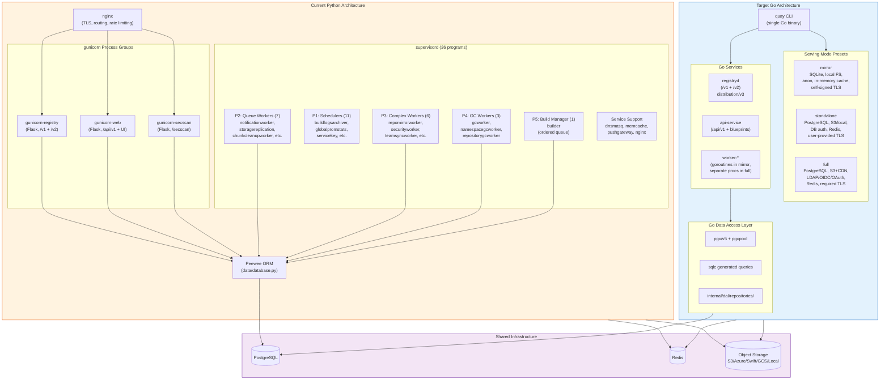
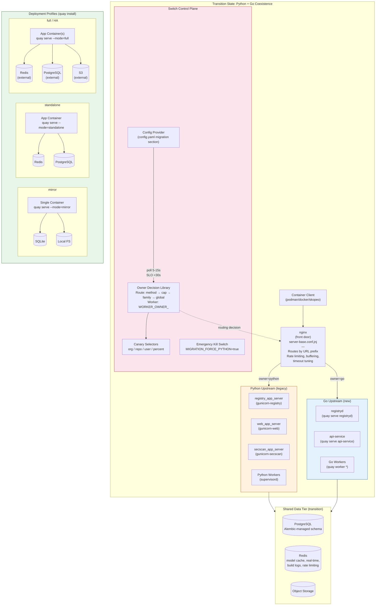
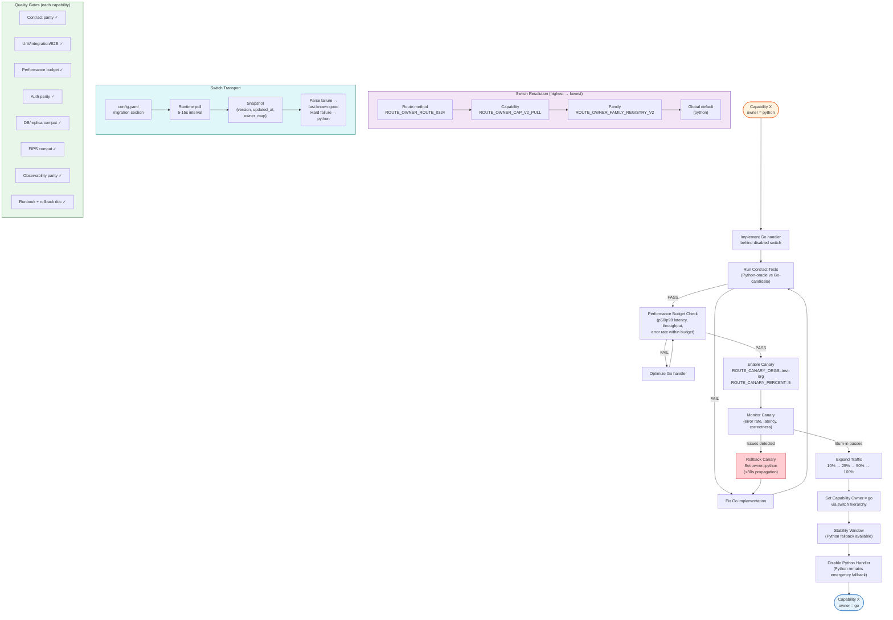
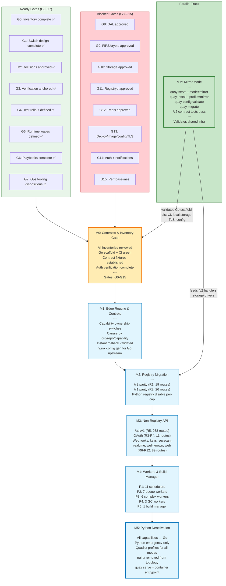
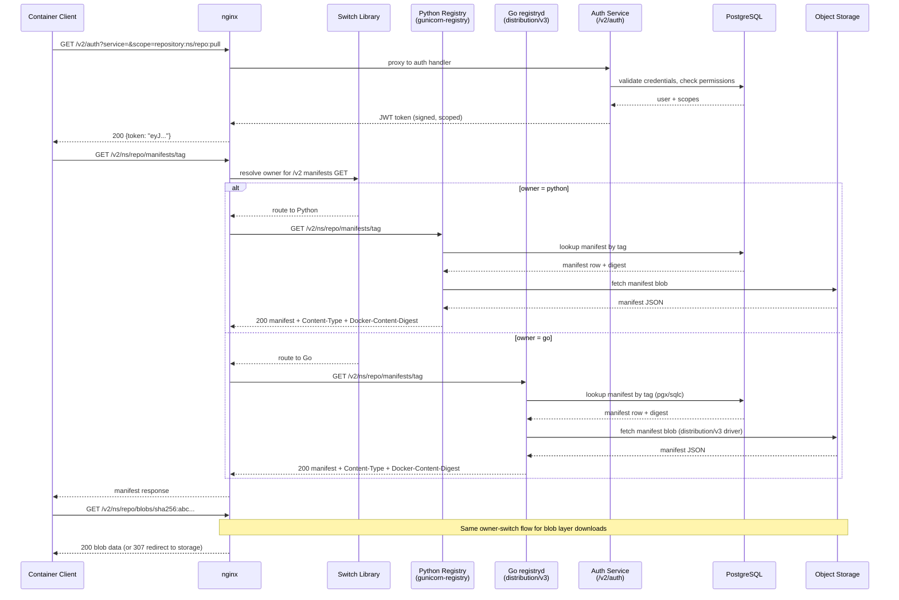
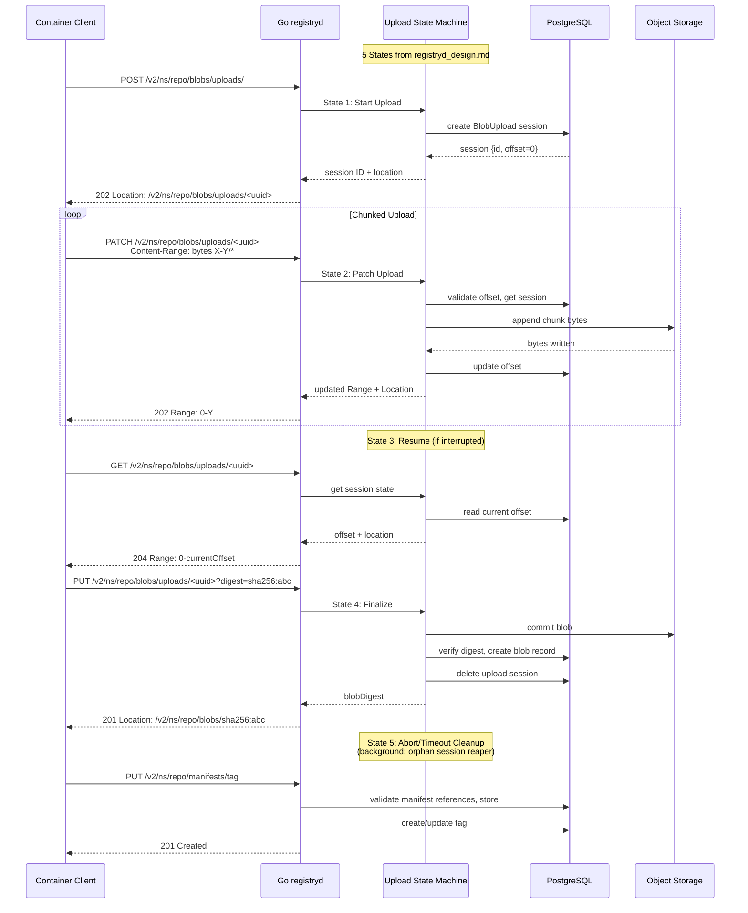
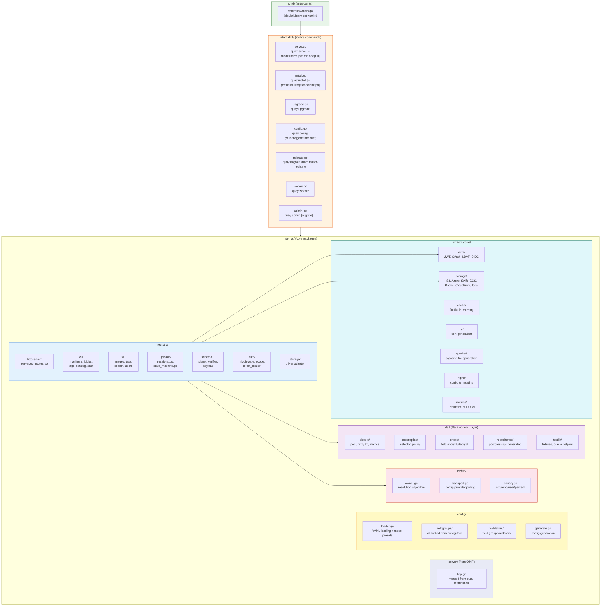
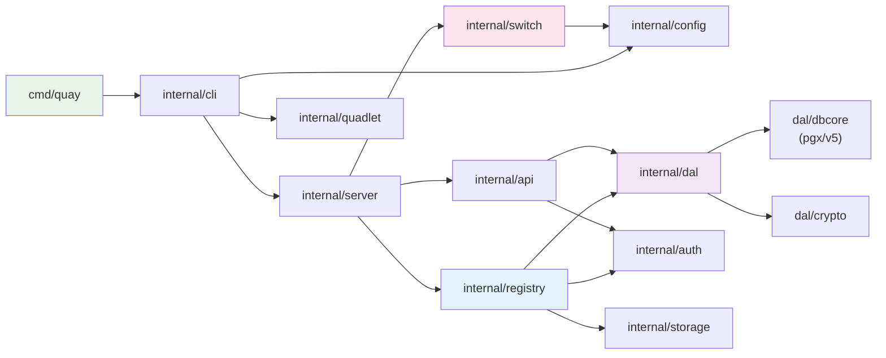

# Quay Rewrite Architecture Diagrams

Status: Draft for team review
Generated: 2026-02-11

---

## 1. System Architecture Overview

Current Python architecture mapped to target Go architecture.

> **Key decisions**: Go uses pgx/v5 + sqlc (not GORM/ent). Alembic remains migration authority until M5+. Distribution v3 provides the registry core. Single binary with subcommands replaces supervisord + 3 gunicorn groups.

---

## 2. Migration Topology (Transition State)

Containerized deployment during Python/Go coexistence with deployment profiles.

> **Risk note**: During coexistence, both Python and Go read/write the same PostgreSQL database. The expand-migrate-contract pattern governs schema evolution. No non-additive DDL without an approved exception per `db_migration_policy.md`.

---

## 3. Capability Cutover Flow

Lifecycle of migrating one capability from Python to Go ownership.

> **Rollback is a single config change** (no redeploy). Set owner back to `python`, wait <30s for propagation, confirm via owner-decision metrics. Emergency: `MIGRATION_FORCE_PYTHON=true` forces all capabilities back to Python.

---

## 4. Milestone Dependency Graph

> **MM runs in parallel** and does not block M1-M5. It validates the Go binary, CI pipeline, distribution v3, local storage, TLS, and config subsystems. Results feed into M0 readiness and M2 registry work. **8 gates (G8-G15) are currently blocked** pending architectural approval.

---

## 5. Data Flow: Registry Push/Pull

### 5a. Registry V2 Pull (Manifest + Blob)

### 5b. Registry V2 Push (with Upload State Machine)

> **Cross-runtime risk**: Upload sessions store hasher state as pickle+base64 in Python. During M2-M3, upload ownership is pinned by UUID (no mid-upload owner switch). Post-M4: JSON/protobuf cross-runtime hasher format.

---

## 6. Queue and Worker Dependency Map

```mermaid
graph TB
    subgraph queues["9 Queues"]
        q1["chunk_cleanup<br/>(no namespace)"]
        q2["imagestoragereplication<br/>(no namespace)"]
        q3["proxycacheblob<br/>(namespaced)"]
        q4["dockerfilebuild<br/>(namespaced, ORDERED)"]
        q5["notification<br/>(namespaced)"]
        q6["secscanv4<br/>(no namespace)"]
        q7["exportactionlogs<br/>(namespaced)"]
        q8["repositorygc<br/>(namespaced)"]
        q9["namespacegc<br/>(no namespace)"]
    end

    subgraph producers["Producers (Route/Model Layer)"]
        pr1["storage/swift.py<br/>(Swift chunk ops)"]
        pr2["util/registry/replication.py<br/>(push/mirror triggers)"]
        pr3["registry_proxy_model.py<br/>(proxy-cache pulls)"]
        pr4["endpoints/building.py<br/>(build API)"]
        pr5["notifications/__init__.py<br/>(event triggers)"]
        pr6["endpoints/secscan.py<br/>(Clair callbacks)"]
        pr7["data/logs_model/shared.py<br/>(log export API)"]
        pr8["data/model/repository.py<br/>(repo delete)"]
        pr9["data/model/user.py<br/>(namespace delete)"]
    end

    subgraph consumers["Consumers (Worker Phases)"]
        subgraph P2["P2: Queue Workers"]
            w1["chunkcleanupworker"]
            w2["storagereplication"]
            w3["proxycacheblobworker"]
            w4["notificationworker"]
            w5["securityscanningnotificationworker"]
            w6["exportactionlogsworker"]
        end

        subgraph P4["P4: GC Workers"]
            w7["repositorygcworker"]
            w8["namespacegcworker"]
        end

        subgraph P5["P5: Build Manager"]
            w9["builder<br/>(ordered queue,<br/>custom retry)"]
        end
    end

    pr1 --> q1 --> w1
    pr2 --> q2 --> w2
    pr3 --> q3 --> w3
    pr4 --> q4 --> w9
    pr5 --> q5 --> w4
    pr6 --> q6 --> w5
    pr7 --> q7 --> w6
    pr8 --> q8 --> w7
    pr9 --> q9 --> w8

    subgraph qmt_gates["Queue Mixed-Mode Tests (QMT)"]
        qmt1["QMT-CHUNK-CLEANUP<br/>gates: registry blob upload cutover"]
        qmt2["QMT-IMAGE-REPLICATION<br/>gates: replication route cutover"]
        qmt3["QMT-PROXY-CACHE-BLOB<br/>gates: proxy-cache route cutover"]
        qmt4["QMT-NOTIFICATION<br/>gates: api-v1 notification routes"]
        qmt5["QMT-EXPORT-ACTION-LOGS<br/>gates: api-v1 log export routes"]
        qmt6["QBT-DOCKERFILE-BUILD-ORDERED<br/>gates: build API + P5 builder"]
    end

    q1 -.-> qmt1
    q2 -.-> qmt2
    q3 -.-> qmt3
    q5 -.-> qmt4
    q7 -.-> qmt5
    q4 -.-> qmt6

    style queues fill:#fff3e0,stroke:#e65100
    style producers fill:#e8eaf6,stroke:#283593
    style consumers fill:#e3f2fd,stroke:#1565c0
    style qmt_gates fill:#fce4ec,stroke:#c62828
    style P2 fill:#e3f2fd,stroke:#1565c0
    style P4 fill:#e3f2fd,stroke:#1565c0
    style P5 fill:#e3f2fd,stroke:#1565c0
```

### Worker Rollout Phase Summary

```mermaid
gantt
    title Worker Migration Phases
    dateFormat X
    axisFormat %s

    section P0 Service Support
    dnsmasq, nginx, memcache, gunicorn-*, pushgateway (7)    :p0, 0, 1

    section P1 Schedulers
    buildlogsarchiver, globalpromstats, servicekey, etc (11)  :p1, 1, 2

    section P2 Queue Workers
    chunkcleanup, storagerepl, notification, etc (7)          :p2, 2, 3

    section P3 Complex Workers
    repomirror, securityworker, teamsync, etc (6)             :p3, 3, 4

    section P4 GC Workers
    gcworker, namespacegc, repositorygc (3)                   :p4, 4, 5

    section P5 Build Manager
    builder - ordered queue semantics (1)                      :p5, 5, 6
```

> **Queue contract**: At-least-once delivery, compare-and-swap claim via `id + state_id`. Build queue requires ordered claims. 3 queues (`proxy_cache_blob`, `secscan_notification`, `export_action_logs`) are missing from `all_queues` in `app.py` - namespace-deletion cleanup does not purge them.

---

## 7. Package Layout

Reconciled Go package structure from rewrite plan and OMR proposal.

### Package Dependency Flow

> **Key integration point**: `internal/config/` absorbs both the config-tool field group validators and the OMR proposal's config generation. `internal/server/` merges the quay-distribution-main HTTP server. `internal/quadlet/` generates systemd unit files for containerized deployment, replacing the mirror-registry Ansible/EE orchestration.

---

## Appendix: Route Family Migration Sequence

Reference table for team review.

| Phase | Route Family | Method Rows | Mutating | Priority Notes |
|-------|-------------|-------------|----------|----------------|
| R1 | `registry-v2` | 19 | 9 | Start with auth/read, then push/upload/delete |
| R2 | `registry-v1` | 26 | 12 | Full compat required; do not de-scope |
| R3 | `oauth2` | 10 | 4 | Preserve callback + redirect semantics |
| R4 | `oauth1` | 1 | 0 | Preserve callback registration |
| R5 | `api-v1` | 268 | 153 | Largest surface; reads first, then mutations |
| R6 | `webhooks` | 3 | 3 | Protect signature/secret validation |
| R7 | `keys` | 4 | 2 | Keyserver endpoints |
| R8 | `secscan` | 3 | 1 | Coordinate with secscan notification queue |
| R9 | `realtime` | 2 | 0 | SSE/WebSocket endpoints |
| R10 | `well-known` | 2 | 0 | OIDC discovery |
| R11 | `web` | 65 | 4 | Triage contract-critical vs UI render |
| R12 | `other` | 10 | 3 | userfiles, _storage_proxy_auth |
| **Total** | | **413** | **191** | |
